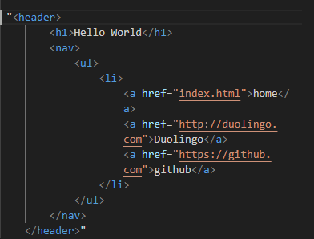

# html course

## Html course Review

## negatives
1. I don't think there's enough exercises in the course maybe add some little exercies throughout the section for some practice
2. There's not alot of content for the html course it'd be cool if it was a little more detailed and the sections were a bit longer
3. it feels like around section 3 there's not alot of explainations of what does what it's more like just examples but that get's better again in section five when you start talking about SEO and Metadata
4. there were some things that the course assumed they already knew I think you fixed some of them one of them was Javascript it was mentioned you could use it in html in section 4 but never went into any kind of detail on how to use it then required it in the project  
5. You should go over nested elements like &lt;p&gt; &lt;strong&gt; HELLO WORLD &lt;strong/&gt; hello world hello world hello world &lt;p/&gt;
6. maybe go over a bit of the styling attributes in html it might help when they go into the css course

## Positives
1. Section 2 was one of my favorite sections because of how it explained things and how it kind of built off from section 1
2. the sections try to build off of eachother 
3. It has enough information that by the end of it you should have atleast begginer knowledge of html
4. the site its written in almost all html which mathces theme and is kind of cool
5. the course has a Glossary
6. the final project wraps up all the sections into one very nicely

## Section 1 Review

### Negatives
1. Under the Html Attributes it mentions the opening tag you might give a breif explaination of them there
2. for the &lt;img&gt; and &lta&gt when I was doing the project I wasn't entirly sure of the attribute used with for the &lt;img&gt; it was src and href for the &lt;a&gt;
3. When you show the example for using Semantic Elements you might add a some more comments about what you're doing in the example

### Positives
1. I like the way the course is structured it's easy to read and i can get through it fairly quick  
2. The course covered some very important begining subject for html like attributes inline vs block and even mentioned where to code html(HTML Editors and Tools)
3. The examples were really good and fairly easy to understand

## Section 2 Review

### Negatives
1. Before explaing why to use Semantic HTML you should have a section that explains in a little more detail what it is
2. In the project you should have them use &lt;section&gt; to along with the other html tags
3. I think one was more my bad but when I was doing the project I used the &lt;li&gt; wrong...  I'll put an example here below

 

### Positives
1. Again from 1 and 2 structrued really well and goes over an important concept to html(Semantic HTML)
2. The example were pretty good and easy to understand
3. Explaining why to use semantic HTML and what it does was a great idea
4. I liked how some things kind of built off of section 1

## Section 3 Review

### Negatives
1. I think you forgot to mention that you can use &ltu&gt to generate underlined text 
2. for the Subscript and Superscript formatting you don't show how to create that in html

3. In the examples for lists and tables it'd be cool if you could describe what's happening a bit more in the example and what each tag does

4. I think you should add more exercises to each section maybe one in the middle and at the beggining you could have them review things from previous sections too

### Positives
1. structrued really well and goes over some cool formatting in html along with lists and tables
2. more specifically I like how structrued the "Text Formatting Examples" with an example of the formated and text and a description on how to create it in html
3. I liked the tips for lists and tables it'd be cool if you can fit that into other sections too
4. I liked how the project included things from previous projects

## Section 4 Review

### Negatives
1. Instead of just showin an example of a form you should go into more detail about what each attribute and element does
2. Probably leave out the javascript in this section also in the exercise you said to use javacript but I didn't see any in your example 
3. You should add a little more requirements in the exercise so the final version would have to look more like a webpage to meet the requirements

### Positives
1. structrued is nice and short 
2. It goes over imprtant atributes and User input elements 
3. Tries to build off from other sections

## Section 5 Review

### Negatives
1. Under Multimedia some more description of what's going on in the examples would be cool
2. you should mention how to get different kinds of multimedia to use for html 
3. I feel like a deeper explaination of SEO, Metadata and ARIA would benifit the course
4. In the exercise you could probably just say Embedding Multimedia instead of Embedding Multimedia from Section 5

### Positives
1. structrued really well
2. It goes over ARIA Roles, SEO and Metadata along with multimedia elements which are important concepts to html
3. The exercise reviews all of the sections and has you practice with what's taught in the current section
4. I liked how SEO, Metadata and ARIA Roles was explained with the examples and a description of the elements but a deeper explaination of it would be cool 

## My Profile Review

### Negatives
1. weren't really any requirements listed for the project 

### Positives
1. Left alot of room for playing around
2. combined all of the sections together into one project
3. the example was star wars themed